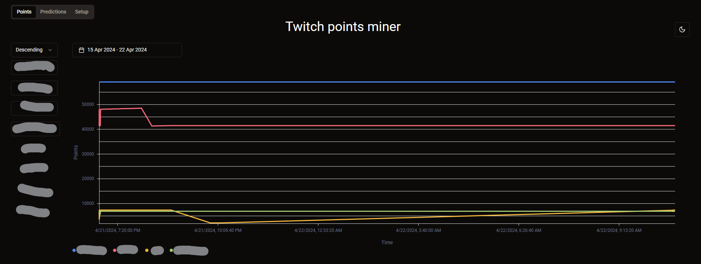
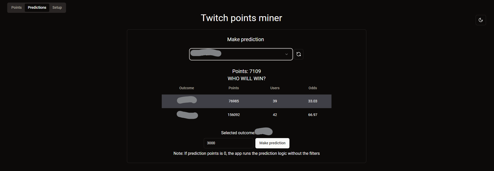
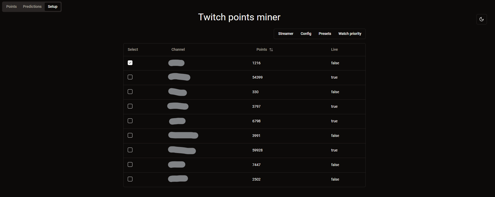
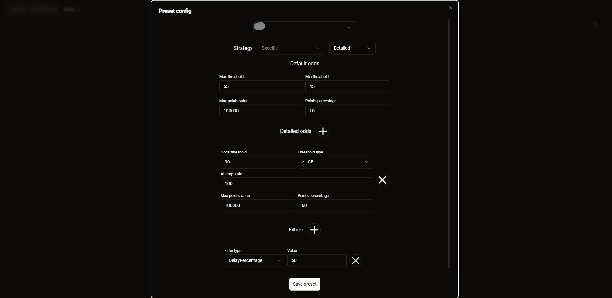

<h1 align="center">twitch-points-miner</h1>
<p align="center">
  
  
  
  
  
</p>


<p align="center">
  A very lightweight twitch points miner, using only a few MB of ram, inspired by <a href="https://github.com/rdavydov/Twitch-Channel-Points-Miner-v2">Twitch-Channel-Points-Miner-v2</a>.
</p>



## Features
* Web UI to interact with the app, and change configurations at runtime [screenshots](#Web-UI-screenshots)
* Auto place bets on predictions
* Watch stream to collect view points
* Claim view point bonuses
* Follow raids
* REST API to manage app (Swagger docs at /docs)
* Analytics logging all actions

## Configuration
Check [example.config.yaml](example.config.yaml) for an example configuration.

For a complete list of all configuration possibilities, check [common/src/config](common/src/config).

Use the log level `info` for adequate information. Use `debug` for detailed logs, or if you feel a bug is present.

## Docker image
This is the suggested way of using twitch-points-miner.

Pull [t348575/twitch-points-miner](https://hub.docker.com/r/t348575/twitch-points-miner), be sure to pass your config file, and a volume for your `tokens.json`, as well as appropriate CLI arguments.

Run with stdin attached the first time, in order to authenticate your twitch account.
```
docker run -i -t -v ./data:/data t348575/twitch-points-miner --token /data/tokens.json
```
Once it is running and the login flow is complete, CTRL+C then just attach the tokens file in subsequent runs.

## Docker compose
An example docker compose file
```yaml
services:
  twitch-points-miner:
    container_name: twitch-points-miner
    image: t348575/twitch-points-miner:latest
    volumes:
      - ./data:/data
      - ./config.yaml:/config.yaml # change this if needed to your config file
    command:
      - -t /data/tokens.json
      - --analytics-db
      - /data/analytics.db
      - --log-file
      - /data/twitch-points-miner.log
    ports:
      - 3000:3000 # Web UI port
    environment:
      - LOG=info
```

## Windows
Has not been tested on windows, but should work fine

## Building
```
cargo build --release
```

## Web UI screenshots




