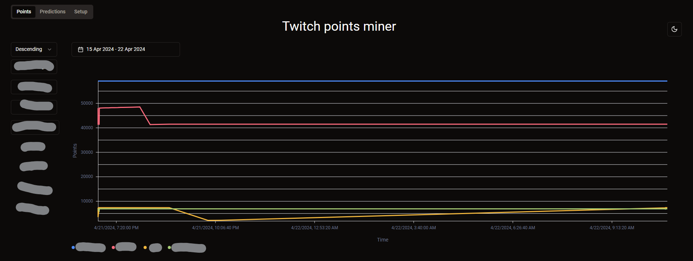
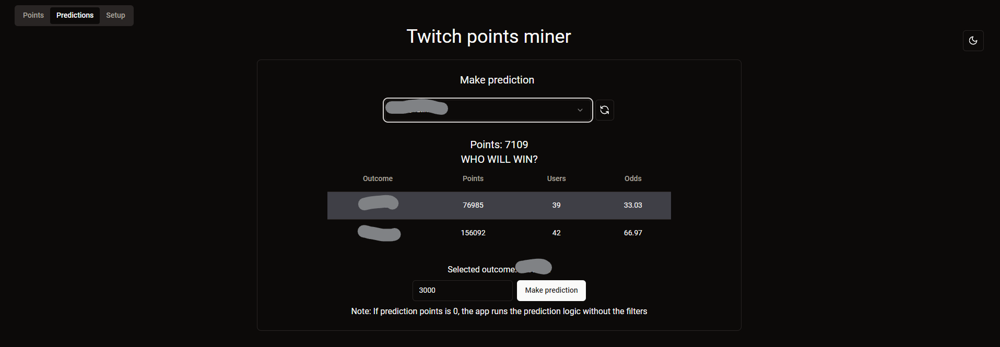
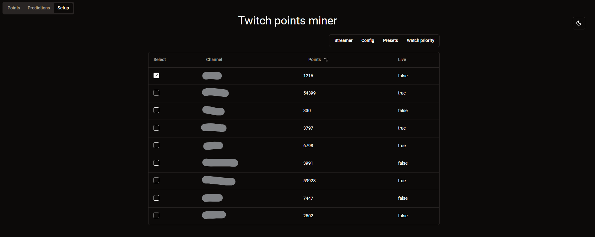
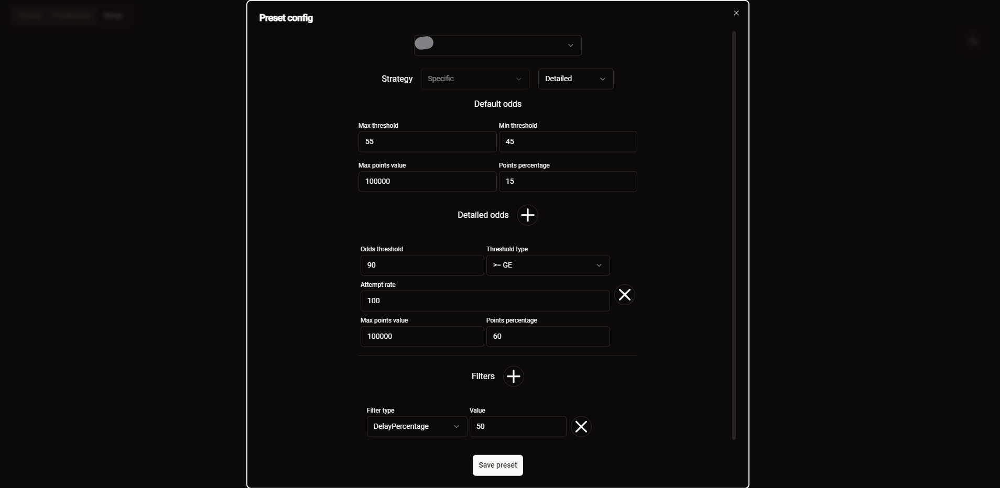

<h1 align="center">twitch-points-miner</h1>
<p align="center">
  
  
  
  
  
</p>

<p align="center">
  A very lightweight twitch points miner, using only a few MB of ram, inspired by <a href="https://github.com/rdavydov/Twitch-Channel-Points-Miner-v2">Twitch-Channel-Points-Miner-v2</a>.
</p>



## Features

- Web UI to interact with the app, and change configurations at runtime [screenshots](#Web-UI-screenshots)
- Auto place bets on predictions
- Watch stream to collect view points
- Claim view point bonuses
- Follow raids
- REST API to manage app (Swagger docs at /docs)
- Analytics logging all actions

## Behavior Details

### Watch Priority

The `watch_priority` list determines which streams are "watched" for viewership points when more than two configured streamers are live. The application can watch a maximum of two streams at once. The list is ordered from **highest priority (first item) to lowest priority (last item)**.

### Point Claiming

The application periodically checks for and claims community point bonuses (the clickable chests) for **every configured streamer that is currently live**. This action is independent of the `watch_priority` list. This is why you will see it successfully claim bonuses from channels that are not one of the two being actively "watched" for viewership points.

### Joining Raids

The application listens for "go live" notifications for **every streamer** in your configuration. When any of these streamers go live, the application then subscribes to their specific raid notifications. This allows it to follow a raid (if `follow_raid: true` is enabled for that streamer) even if the channel is not one of the two being actively "watched".

## Configuration

Check [example.config.yaml](example.config.yaml) for an example configuration.

For a complete list of all configuration possibilities, check [common/src/config](common/src/config).

Use the log level `info` for adequate information. Use `debug` for detailed logs, or if you feel a bug is present.

## Docker image

This is the suggested way of using twitch-points-miner.

Pull [t348575/twitch-points-miner](https://hub.docker.com/r/t348575/twitch-points-miner), be sure to pass your config file, and a volume for your `tokens.json`, as well as appropriate CLI arguments.

Run with stdin attached the first time, in order to authenticate your twitch account.

```
docker run -i -t -v ./data:/data t348575/twitch-points-miner --token /data/tokens.json
```

Once it is running and the login flow is complete, CTRL+C then just attach the tokens file in subsequent runs.

## Docker compose

An example docker compose file

```yaml
services:
  twitch-points-miner:
    container_name: twitch-points-miner
    image: t348575/twitch-points-miner:latest
    volumes:
      - ./data:/data
      - ./config.yaml:/config.yaml # change this if needed to your config file
    command:
      - -t
      - /data/tokens.json
      - --analytics-db
      - /data/analytics.db
      - --log-file
      - /data/twitch-points-miner.log
    ports:
      - 3000:3000 # Web UI port
    environment:
      - LOG=info
```

**Note on First Run:** The application requires an interactive terminal for the first-time login. When running for the first time, use the following command to attach your terminal and complete the authentication process:

```bash
docker-compose run --rm --service-ports twitch-points-miner
```

After the `tokens.json` file is created, you can stop the container (`CTRL+C`) and use `docker-compose up -d` for all subsequent runs.

### Authentication

The authentication process is designed to be interactive on the first run and automatic after that.

1.  **First Run:** When you start the application for the first time, it checks for the token file specified by the `-t` argument. Since it doesn't exist, it will begin an interactive login sequence in your terminal. You will be prompted to go to a Twitch URL in your browser and authorize the application. Confirm in the terminal

2.  **Token Creation:** After a successful login, the application saves your authentication credentials to the token file (e.g., `tokens.json`).

3.  **Subsequent Runs:** On all future runs, the application detects that the token file already exists. It reads the credentials from this file to authenticate with the Twitch API and starts immediately, skipping the interactive login.

### Command-Line Arguments

- `-t /data/tokens.json`: This is the short version of `--token`. It tells the application where to find or store the authentication `tokens.json` file.
- `--analytics-db /data/analytics.db`: This specifies the file path for the SQLite database where analytics data (like points history and prediction outcomes) is stored.
- `--log-file /data/twitch-points-miner.log`: This instructs the application to write its logs to the specified file, which is useful for debugging and reviewing historical activity.

## Windows

Has not been tested on windows, but should work fine

## Building

```
cargo build --release
```

## Web UI screenshots





